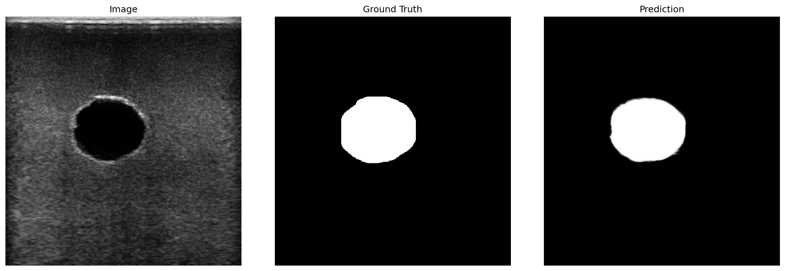

# Vein Segmentation

Ultrasound vein segmentation system using UNet, built for the Clarius HD3 L7 ultrasound device. Covers the full pipeline: data collection, annotation, training, and real-time inference.

## Project Structure

```
vein_segmentation/
├── config.py                # Shared configuration (DataInfo: paths, dataset params)
├── .env                     # Training configuration (hyperparameters, paths)
│
├── collection/              # Data acquisition & annotation
│   ├── collect_clarius.py   # Collect images via Clarius Cast API
│   ├── collect_a325.py      # Collect images via A325 video capture card
│   └── label.py             # Circular brush annotation tool (PySide6)
│
├── training/                # ML training pipeline
│   ├── dataPrepare.py       # Data augmentation & train/val/test split
│   ├── DataInfo.py          # Dataset metadata & path configuration
│   ├── train.py             # UNet training (BCE + Dice, AMP, multi-GPU, W&B)
│   ├── test.py              # Model evaluation & visualization
│   ├── inferencer.py        # Standalone inference engine (UNetInferencer)
│   └── unet/                # UNet architecture (github.com/milesial/Pytorch-UNet)
│
├── data/                    # Datasets (see data/README.md for setup)
│   ├── phantom_1/           # Phantom dataset (download from Google Drive)
│   ├── phantom_2/           # Custom 3D phantom dataset (download from Google Drive)
│   ├── dataset1/            # Common Carotid Artery (download from Mendeley)
│   └── README.md            # Dataset download & path instructions
│
├── lib/                     # Clarius Cast SDK (shared libraries & headers)
├── examples/                # Clarius API usage examples
└── ref/                     # Reference docs & images
```

## Pipeline

```
1. Collect    collect_clarius.py / collect_a325.py  ->  data/*/images/ + meta CSV
2. Annotate   label.py                              ->  data/*/masks/
3. Prepare    dataPrepare.py                         ->  augmented NPZ files
4. Train      train.py                               ->  outputs/checkpoints/*.pth
5. Evaluate   test.py                                ->  metrics & visualizations
6. Inference  inferencer.py                          ->  standalone prediction
```

## Installation

```bash
git clone --recursive https://github.com/alfredzhang98/vein_segmentation.git
cd vein_segmentation
pip install -r requirements.txt
```

### Download Data & Pretrained Weights

| Resource | Link |
|----------|------|
| Phantom datasets | [Google Drive](https://drive.google.com/drive/folders/1LPwezlAUmxWnUo791RM3OPAhGQHq5r0v?usp=sharing) |
| Pretrained models (.pth) | [Google Drive](https://drive.google.com/drive/folders/1YSGUPX_Ck_GIyM49vvtPI5_LDQHro7JR?usp=sharing) |

- Place `.pth` files in `outputs/checkpoints/`
- Extract datasets directly into `data/` — see [data/README.md](data/README.md) for details

## Quick Start

> **Note**: Before training, edit [`.env`](.env) to configure hyperparameters, dataset, and optionally enable [WandB](https://wandb.ai) logging (set `WANDB_ENABLE=true` and fill in your `WANDB_ENTITY`).

```bash
# Prepare augmented dataset (run from project root)
python training/dataPrepare.py --dataset phantom_1

# Train (run from project root)
python training/train.py

# Test
python training/test.py --ckpt outputs/checkpoints/your_checkpoint.pth

# Inference on a single image
python training/inferencer.py outputs/checkpoints/your_checkpoint.pth your_image.png
```

## Results

| Dataset | Test Samples | Dice | Loss | FPS |
|---------|-------------|------|------|-----|
| phantom_2 | 5 | 0.9610 | 0.0570 | 144.9 |



## Real-time Demo

<video src="https://github.com/alfredzhang98/vein_segmentation/raw/main/ref/mdimages/real_time.mp4" controls width="600"></video>

> Real-time ultrasound vein segmentation with UNet inference overlay. If the video doesn't load, [click here to download](ref/mdimages/real_time.mp4).

## Hardware

- **Ultrasound**: Clarius HD3 L7
- **Capture Card**: A325 (alternative to Clarius API)
- **Calibration**: 72.35 um/px (Clarius native) / 83.78 um/px (A325 cropped)

## Datasets

### Phantom Datasets (self-collected)

Download from [Google Drive](https://drive.google.com/drive/folders/1LPwezlAUmxWnUo791RM3OPAhGQHq5r0v?usp=sharing) and extract into `data/`.

- **phantom_1**: Commercial phantom from [Taobao](https://item.taobao.com/item.htm?id=762322402710)
- **phantom_2**: Custom-made phantom (gelatin + agar + saline)

### Public Datasets (download separately)

These datasets are **not included** in the repository. See [data/README.md](data/README.md) for download links and path setup.

- **dataset1: Common Carotid Artery Ultrasound Images** — [Mendeley Data](https://data.mendeley.com/datasets/d4xt63mgjm/1) (CC BY 4.0)
  - 1100 ultrasound images + 1100 expert masks, 709x749x3
  - Mindray UMT-500Plus, L13-3s linear probe, 11 subjects

- **dataset2: Carotid and Femoral Vessel Ultrasound Dataset** — [Kaggle](https://www.kaggle.com/datasets/fa8b3e1386722702d9c80a7d2d10d5d50eef20d14a604078b38d01c66fd9f356) (CC BY-NC 4.0)
  - 2203 train + 911 validation images from 105 videos, 11 volunteers
  - Angell Pionner H20 Ultrasound Scanner

> **Note**: `pretrained_06042026.pth` was trained on phantom_1 + phantom_2 + dataset1 only. dataset2 was **not** used during training.

## License

This project is released under the [CC BY-NC 4.0 License](LICENSE) (Attribution-NonCommercial).

**Third-party dataset licenses:**

| Dataset | License |
|---------|---------|
| dataset1 (Common Carotid Artery) | CC BY 4.0 |
| dataset2 (Carotid and Femoral Vessel) | CC BY-NC 4.0 (non-commercial use only) |

If you use dataset2 in your work, it is restricted to non-commercial purposes per its license.

## Citations

If you use the public datasets, please cite the original authors. Citation info can be found on the respective dataset pages:

- dataset1: [Mendeley Data](https://data.mendeley.com/datasets/d4xt63mgjm/1)
- dataset2: [Springer](https://link.springer.com/chapter/10.1007/978-3-031-72083-3_61)
