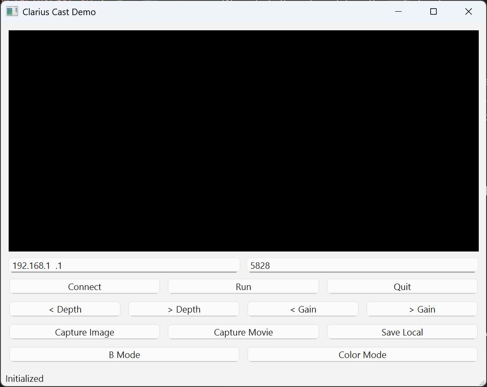
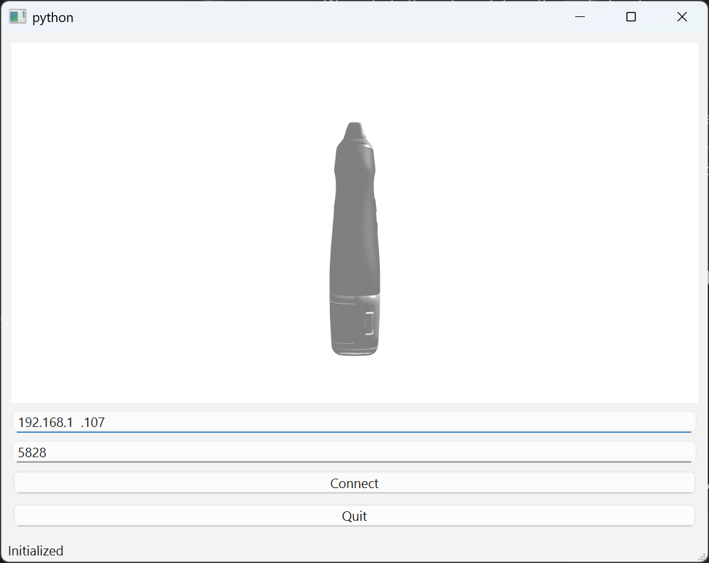
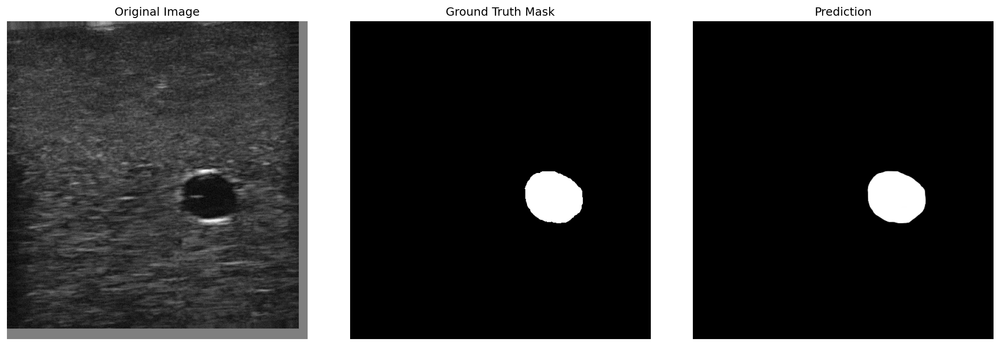

# How to play with Clarius
There are other examples in the `cast_examples` directory.

Here are gui screenshots:
<p align="center">
  
  
</p>

## Clarius Ultrasound Device HD3 L7


# References
We include the submodule in the `ref` directory.

# Segmentation
This Segmentation is use the Clarius ultrasound device [HD3 L7](https://clarius.com/scanners/l7/?filter_specialities=anesthesiology) to collect the ultrasound images.
Here is the application and whole project detials for the segmentation of ultrasound images using Unet model. In order to get the mask of the vein in the ultrasound images.

The result of the prediction on the test dataset:



```
Infering on Tesla V100-PCIE-32GB 

[Inference performance] Total number of samples: 290
[Inference performance] Total inference time: 0.6602s
[Inference performance] Average inference time per image: 0.0023s
[Inference performance] Inference frame rate (FPS): 439.25
[TEST] loss: 0.0155 | dice: 0.9866
```