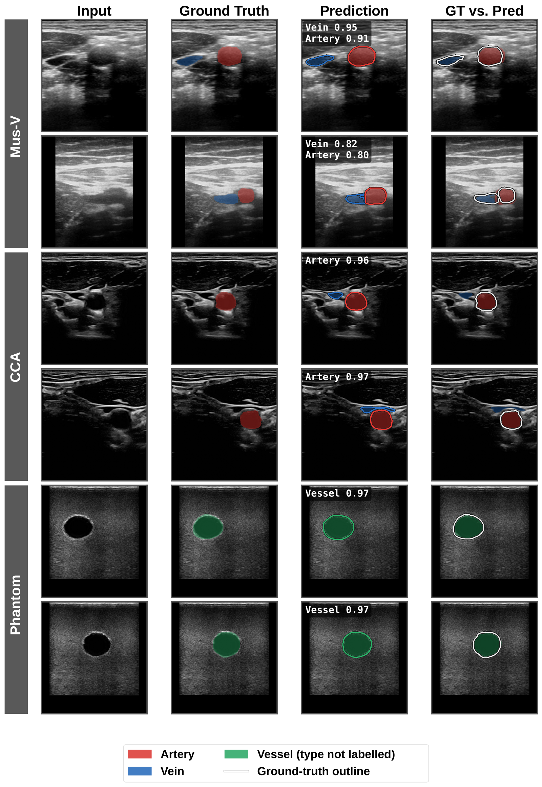

# Vein Segmentation

> 中文版：[README_CN.md](README_CN.md)

Ultrasound vessel segmentation for needle-insertion guidance, built around the Clarius
HD3 L7 probe. The repository covers the whole path from acquisition to a deployable
model: collection, annotation, dataset preparation, training, evaluation, figure
generation, and standalone inference.

The network is a U-Net that emits **three channels — background, vein, artery** — and is
trained jointly on four datasets whose annotations *disagree about what a mask means*.
Resolving that disagreement, rather than the architecture, is what this repository is
about.

---

## The problem, and the objective that solves it

The four training sets do not annotate the same thing:

| Dataset | What the mask marks | What it leaves undetermined |
|---|---|---|
| Mus-V | vein and artery, separately | nothing |
| `phantom_taobao`, `customer_3d_phantom` | a gel tube | whether the tube is a vein or an artery |
| Mendeley CCA | the common carotid artery | the internal jugular vein, usually in frame but **unlabelled** |

Pooling these under one ordinary loss would supervise the CCA set's unlabelled jugular
vein *as background*, and so teach the model that veins look like background — the vein
class is destroyed by the very data meant to help it.

Instead, each annotation is treated as resolving the three classes only up to a
**partition** `𝒢` of the class set. Writing `q_g = Σ_{c∈g} p_c` for the marginal
probability of a group `g ∈ 𝒢` and `y_g ∈ {0,1}` for its label, the compound
cross-entropy–Dice objective is applied to those marginals:

```
L = − (1/|Ω|) Σ_{i∈Ω} Σ_{g∈𝒢} y_{g,i} log q_{g,i}
    + (1/|𝒢⁺|) Σ_{g∈𝒢⁺} ( 1 − (2 Σ_i q_{g,i} y_{g,i} + ε) / (Σ_i q_{g,i} + Σ_i y_{g,i} + ε) )
```

where `Ω` are the pixels of one image, `ε = 1e-6`, and `𝒢⁺` is `𝒢` minus the group
containing the background class.

| Dataset | `label_mode` | Partition `𝒢` | Supervised marginal |
|---|---|---|---|
| Mus-V | `full3` | `{bg}, {vein}, {artery}` | all three (ordinary 3-way CE + Dice on vein and artery) |
| phantoms | `vessel` | `{bg}, {vein, artery}` | `q = p₁ + p₂` |
| Mendeley CCA | `artery` | `{bg, vein}, {artery}` | `q = p₂` |

Two consequences follow directly, and both are the point:

- For the phantoms the loss depends on `p₁ + p₂` **only**, so how that sum splits between
  vein and artery is unconstrained — the split is decided by the prior learned from Mus-V.
  This is what lets you ask a phantom tube "does this look venous or arterial?"
- For the CCA set the loss depends on `p₂` **only**, so it is invariant to how the
  remaining probability divides between background and vein. An unlabelled jugular vein
  can be predicted there at **exactly zero** cost.

When `𝒢` has two groups the first term is exactly binary cross-entropy and the second a
single Dice term, so the expression reduces to the conventional compound BCE–Dice loss.
The implementation lives in `partial_label_loss()` in
[`models/unet/train.py`](models/unet/train.py); everything is computed with `log_softmax` and
`logsumexp`, so `log(p₁ + p₂)` is exact and safe under AMP.

---

## Project structure

```
vein_segmentation/
├── .env                        # ALL training hyperparameters — edit this, not train.py
│
├── data/                       # everything data — see data/README.md (中文: README_CN.md)
│   ├── collection/             #   acquisition (Clarius Cast, A325) + brush labeller
│   ├── pipeline/               #   preprocessing, augmentation, NPZ cache, ReadDataset
│   ├── datasets/               #   the data itself — not tracked, download it yourself
│   ├── clarius_sdk/            #   Clarius native API — acquisition only, never training
│   └── samples/                #   a few example frames, so the commands below run as-is
│
├── models/                     # one self-contained folder per architecture
│   └── unet/                   #   U-Net (after milesial/Pytorch-UNet)
│       ├── model.py  parts.py  #     the network and its blocks
│       ├── train.py            #     partial-label loss, validation, checkpointing
│       ├── test.py             #     held-out evaluation, post-processing, FPS
│       └── infer.py            #     standalone inference + geometry (no training deps)
│
├── analysis/                   # measurement, not training
│   └── unet_analysis/          #   takes a U-Net checkpoint — see the note below
│       ├── bench_fps.py        #     end-to-end latency / FPS
│       ├── summarize_model.py  #     parameter & config summary tables
│       ├── predict_geometry.py #     mask -> centroid, lateral offset, depth, radius
│       └── probe_generalization.py   # cross-domain probing of a checkpoint
│
├── results/                    # what is worth keeping — tracked, one subdir per architecture
│   └── unet/                   #   U-Net results
│       ├── README.md           #     results, experiment log and paper material
│       ├── README_CN.md        #     the same, in Chinese
│       ├── figure_style.py  plot_results.py  plot_segmentation_samples.py
│       └── figures/            #     the generated figures, incl. the published one
│
├── gpu_utils.py                # idle-GPU selection, shared by everything
└── wandb/                      # W&B run data — not tracked
```
**Run every script from the repository root.** Dataset paths in `dataPrepare.py` are
relative (`data/datasets/...`); every script adds the repository root to `sys.path`
itself, so `data.pipeline.*` and `models.<arch>.*` resolve the same way however the file
is launched.

**Adding an architecture** means adding `models/<arch>/` with its own `model.py`,
`train.py`, `test.py` and `infer.py`, and pointing `CHECKPOINT_DIR` in [`.env`](.env) at
`models/<arch>/checkpoints`. Nothing under `data/` has to change — the pipeline, the
label space and the dataset configs are shared as they are. `analysis/` follows the same
convention: `analysis/unet_analysis/` today, `analysis/<arch>_analysis/` alongside it.

**`analysis/` is architecture-specific today.** All four scripts construct a `UNet`
directly, and `summarize_model.py` prints a hand-written description of the U-Net
topology. They are at the top level because *measuring* latency, geometry and
cross-domain generalisation is a generic need — but the code is not generic yet.

---

## Installation

```bash
git clone --recursive https://github.com/alfredzhang98/vein_segmentation.git
cd vein_segmentation
pip install -r requirements.txt
```

---

## Data

Nothing under `data/datasets/` is tracked — two of the four sets are under licences that forbid
redistribution here. See [data/README.md](data/README.md) for per-dataset download links
and the exact directory layout each one must end up in.

| Directory | Source | `label_mode` | Train samples/epoch | Val |
|---|---|---|---|---|
| `data/datasets/Mus-V/` | public, Kaggle/Springer | `full3` | 17 624 (70.9%) | 911 |
| `data/datasets/mendeley_data/` | public, Mendeley Data | `artery` | 3 850 (15.5%) | — |
| `data/datasets/phantom_taobao/` | self-collected, commercial phantom | `vessel` | 2 560 (10.3%) | 13 |
| `data/datasets/customer_3d_phantom/` | self-collected, custom gelatin/agar phantom | `vessel` | 840 (3.4%) | 4 |

The two phantom validation splits are **pooled** into one 17-image metric — scored apart,
a 4-image split is noise.

Once the data are in place, build the augmented NPZ caches:

```bash
python data/pipeline/dataPrepare.py --dataset musv
python data/pipeline/dataPrepare.py --dataset mendeley --no-png
python data/pipeline/dataPrepare.py --dataset phantom_taobao
python data/pipeline/dataPrepare.py --dataset customer_3d_phantom
python data/pipeline/dataPrepare.py --check-stale     # which caches no longer match the config
```

---

## Quick start

All hyperparameters, dataset selection and checkpoint criteria live in
[`.env`](.env) — the shipped values are the ones that produced the released checkpoint.
Set `WANDB_ENABLE=false` if you do not want experiment logging.

```bash
# Train (reads .env; picks an idle GPU by itself)
python models/unet/train.py

# Evaluate a checkpoint on the held-out test splits
python models/unet/test.py --ckpt models/unet/checkpoints/unet_v10.pth \
                           --dataset musv mendeley phantom_taobao+customer_3d_phantom

# Latency / throughput
python analysis/unet_analysis/bench_fps.py --ckpt models/unet/checkpoints/unet_v10.pth

# Geometry from a single frame (centroid, lateral offset, depth, radius)
python analysis/unet_analysis/predict_geometry.py --ckpt models/unet/checkpoints/unet_v10.pth \
                                    --image data/samples/0016.png \
                                    --dataset phantom_taobao

# Regenerate the published figure
python results/unet/plot_segmentation_samples.py --ckpt models/unet/checkpoints/unet_v10.pth \
       --n 2 --seed-phantom 41 --seed-musv 13 --seed-cca 116
```

Standalone inference, with no training-side imports:

```python
from models.unet.infer import UNetInferencer

inf  = UNetInferencer("models/unet/checkpoints/unet_v10.pth")
mask = inf.predict("frame.png")
g    = inf.measure(mask, mm_per_px=0.0832)          # 4 cm depth; 0.104 for 5 cm
print(g["artery"]["lateral_mm"], g["artery"]["depth_mm"], g["artery"]["radius_mm"])
```

---

## Results

Reference checkpoint: **`models/unet/checkpoints/unet_v10.pth`**
(U-Net, `base_ch=32`, 7 762 531 parameters, dropout 0.3, epoch 19, best PRIMARY 0.8622).
Test splits are held disjoint at the sequence and subject level.

| Test set | Class | Dice |
|---|---|---|
| `customer_3d_phantom` — the domain the guidance experiments run in | vessel | **0.970** |
| `phantom_taobao` | vessel | **0.866** |
| Mendeley CCA | artery | **0.956** |
| Mus-V | artery | **0.882** |
| Mus-V | vein | **0.617** |

Dice is measured **after** the morphological post-processing the deployed pipeline
applies, since that is what the robot actually consumes; `models/unet/test.py` prints the
raw-argmax table alongside it so post-processing cannot hide the model's behaviour.
Reproduce with:

```bash
python models/unet/test.py --ckpt models/unet/checkpoints/unet_v10.pth \
       --dataset musv mendeley customer_3d_phantom phantom_taobao --min-area 150
```

`--min-area 150` is required: the flag **defaults to 0**, which disables post-processing
entirely, and the numbers above are the post-processed ones the deployed pipeline
produces. Without it the vein scores 0.612 rather than 0.617.

### Latency

Measured on an idle NVIDIA H200 NVL, batch size 1, AMP on, 200 timed frames after 30
warm-up frames, on a real frame rather than noise:

| Stage | p50 | p95 | worst of 200 | FPS |
|---|---|---|---|---|
| Network forward | 2.60 ms | 2.61 ms | 2.62 ms | 385 |
| + `fit` / `unfit` (`predict`) | 2.89 ms | 2.90 ms | 3.26 ms | 345 |
| **+ post-processing + geometry (end to end)** | **5.57 ms** | **5.65 ms** | **6.20 ms** | **179** |

End to end the module runs at **5.6 ms per frame, i.e. 179 fps** — well above the
ultrasound frame rate, so segmentation does not bound the guidance loop. Note where the
time goes: post-processing and moment analysis are **2.7 ms, 48% of the budget**, and
they run on the CPU in OpenCV, so they do not get faster with a better GPU. Measure on
your own hardware with:

```bash
python analysis/unet_analysis/bench_fps.py --ckpt models/unet/checkpoints/unet_v10.pth \
       --frame data/samples/0016.png --n 200
```



Rows are Mus-V, Mendeley CCA and the phantom. Note the CCA rows: the model outlines a
vein (blue) beside the carotid that the ground truth does **not** label. That is the
partial-label objective working as designed — the CCA loss is invariant to the vein, so
predicting it there costs nothing, and the vein prior carries over from Mus-V.

The full-resolution published figure is kept at
[`results/unet/figures/segmentation_samples.svg`](results/unet/figures/segmentation_samples.svg).

**On the vein score.** 0.617 is governed by *detection*, not delineation: on the 81.1% of
frames where the vein is found at all, Dice is 0.751, against 0.905 for the artery under
the same criterion. A vein is thin-walled and collapses under probe pressure — recall
falls to 0.46 on the most flattened quintile of cross-sections, and in 14 test frames the
vein is compressed to zero cross-section, a mode the artery never exhibits. Mus-V's 105
sweeps come from only 11 volunteers, which bounds how much of that deformation a
single-frame model can learn. See [results/unet/README.md](results/unet/README.md)
for the full analysis, the experiment log and the paper material.

---

## Deployment

### Post-processing

The deployed path and the evaluation path share their morphology: open (3×3 ellipse) →
close (5×5) → keep the largest component per class → drop anything below `min_area`.
`clean()` in [`models/unet/infer.py`](models/unet/infer.py) stops there (`min_area=300`);
`clean_binary()` in [`models/unet/test.py`](models/unet/test.py) adds an anchor and a
distance gate on top (`min_area=150`, `max_dist=40`). The Dice figures above are measured
**after** post-processing, since that is what the robot consumes, and `test.py` prints the
raw-argmax table alongside so the post-processing cannot hide the model's behaviour.

### False positives on vessel-free frames

Dice only answers "when a vessel is there, is it outlined well". Deployment adds a
question training never scores: with the probe over tissue containing no vessel, does the
model still light up? Two levers, most useful first:

1. **Minimum connected-component area.** A vessel is far larger than a speckle blob, and
   `clean()` already filters below `min_area`. Raise it until the false positives vanish
   on vessel-free frames, then confirm Dice on real ones has not moved.
2. **Confidence margin.** The model takes a plain argmax over three softmax channels;
   requiring the winning class to clear a margin before it is accepted trades recall for
   precision.

The 40 vessel-free frames from the second phantom session (`mask_status=test` in
`meta_phantom_taobao_1.csv`, against 92 annotated `true` frames) exist for exactly this
measurement. They are in no training or test split.

> **Do not report on the tuning set.** Tune `min_area` or the margin on those frames and
> they have become a validation set. Final numbers come from the test splits, with the
> false-positive rate quoted separately.

### Threshold sensitivity

Measured on the earlier binary model: across τ ∈ {0.25, 0.50, 0.75} F1 moved by less than
0.005 on both the phantom and the CCA test set — the predicted probabilities sit near 0
and 1, so the operating point was never delicate. The released model is 3-class and uses
argmax, so there is no threshold to choose at all; the measurement is recorded here
because it is the reason that question is closed.

---

## Real-time demo

https://github.com/user-attachments/assets/f3ac8a1e-8759-4e72-b5cd-6a491dfb8b4b

---

## Hardware

- **Ultrasound**: Clarius HD3 L7
- **Capture card**: A325 (alternative to the Clarius Cast API)
- **Calibration**: 72.35 µm/px (Clarius native) / 83.78 µm/px (A325, cropped)

The network is a pure pixel-to-pixel map. Physical scale enters only *after* the predicted
mask is returned to the native image grid, so a single calibration constant converts both
axes exactly.

---

## License

Released under the [CC BY-NC 4.0 License](LICENSE) (Attribution–NonCommercial).

| Third-party dataset | License |
|---|---|
| Common Carotid Artery Ultrasound Images (Mendeley) | CC BY 4.0 |
| Carotid and Femoral Vessel Ultrasound Dataset (Mus-V) | CC BY-NC 4.0 — non-commercial only |

---

## References

- **U-Net architecture** — [milesial/Pytorch-UNet](https://github.com/milesial/Pytorch-UNet)
- **Common Carotid Artery Ultrasound Images** — [Mendeley Data](https://data.mendeley.com/datasets/d4xt63mgjm/1)
- **Carotid and Femoral Vessel Ultrasound Dataset (Mus-V)** — [Springer](https://link.springer.com/chapter/10.1007/978-3-031-72083-3_61) · [Kaggle](https://www.kaggle.com/datasets/fa8b3e1386722702d9c80a7d2d10d5d50eef20d14a604078b38d01c66fd9f356)
- **Albumentations** — [albumentations-team/albumentations](https://github.com/albumentations-team/albumentations)
- **Weights & Biases** — [wandb.ai](https://wandb.ai)
